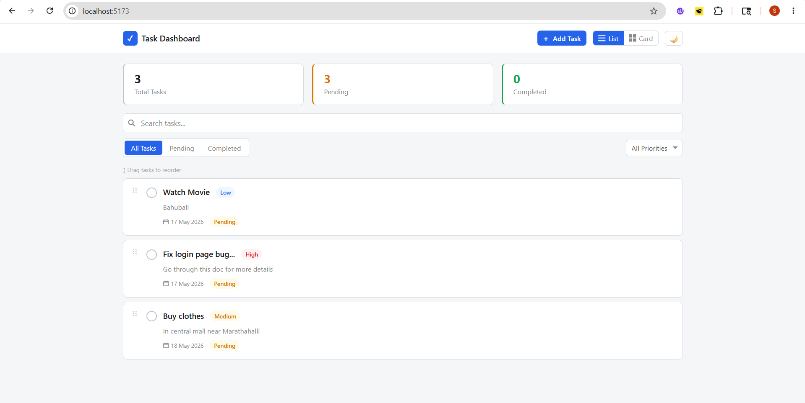
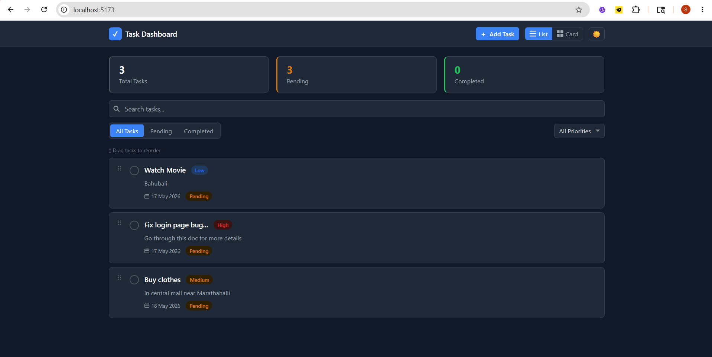
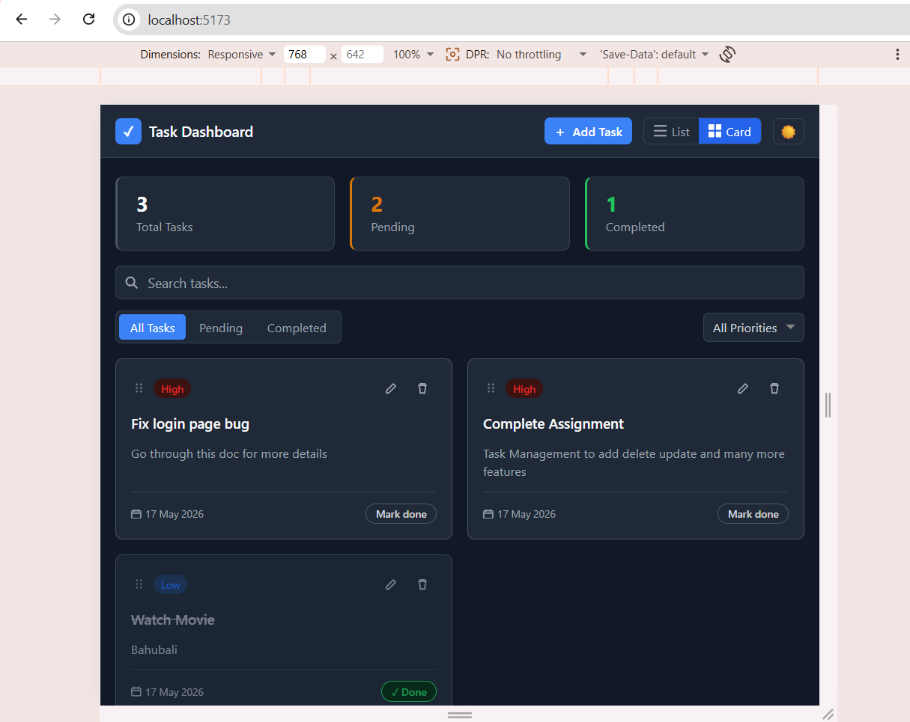
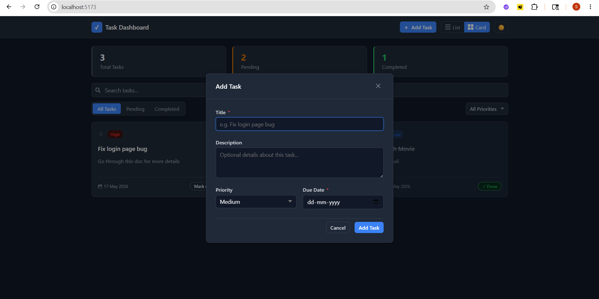
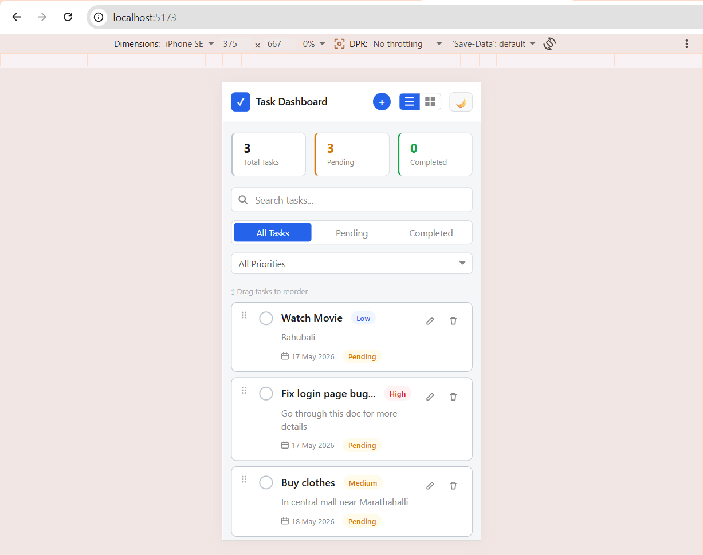
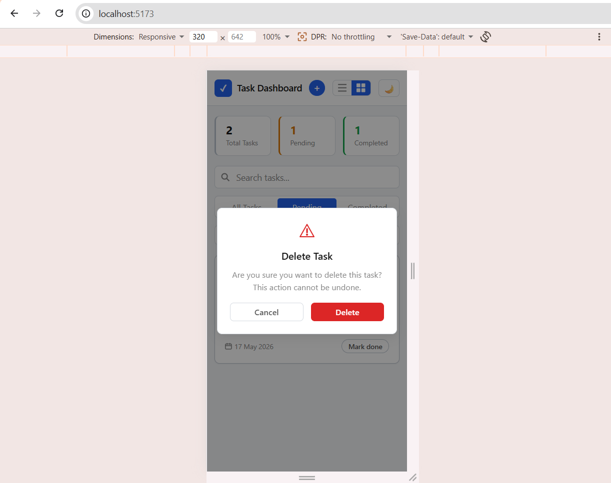

# Task Management Dashboard

A clean, production-quality task management app built with React, TypeScript, and Redux Toolkit.

## Live Demo

[View deployed app →]()

## Screenshots

### Light Mode — List View



### Dark Mode — List View



### Card View



### Add Task



### Mobile View



### Delete Confirmation



## Features

### Core

- **Create tasks** — title, description, priority (Low/Medium/High), due date with validation
- **Edit tasks** — modal-based editing with pre-filled form
- **Delete tasks** — confirmation dialog before deletion
- **Complete/incomplete toggle** — strikethrough, opacity change, status badge update
- **Search** — filter tasks by title or description in real time
- **Filter** — by status (All/Pending/Completed) and priority (All/Low/Medium/High)
- **Task stats** — total, pending, completed counts always visible in header
- **Data persistence** — tasks and view mode saved to localStorage, survives page refresh
- **Responsive** — works on desktop, tablet, and mobile

### Bonus

- **List & Card view** — toggle between layouts, preference persists on refresh
- **Drag-and-drop** — reorder tasks in both list and card view
- **Dark/Light mode** — respects system preference, toggle in header, persists on refresh
- **Toast notifications** — feedback on every action (add, edit, delete, complete, undo)
- **Overdue indicator** — past due date tasks highlighted in red
- **Smart hover states** — green preview on pending, red undo hint on completed

## Tech Stack

| Category         | Technology                           |
| ---------------- | ------------------------------------ |
| Framework        | React 19 + Vite                      |
| Language         | TypeScript                           |
| State Management | Redux Toolkit                        |
| Drag and Drop    | @dnd-kit/core, @dnd-kit/sortable     |
| Notifications    | react-toastify                       |
| Testing          | Vitest + React Testing Library       |
| Styling          | Plain CSS with CSS custom properties |

## Project Structure

```
src/
├── app/
│   └── store.ts                  # Redux store
├── features/tasks/
│   ├── tasksSlice.ts             # All task state + actions
│   └── tasksSelectors.ts         # Memoized selectors
├── components/
│   ├── Header/                   # App bar, view toggle, theme toggle
│   ├── StatsBar/                 # Total, pending, completed counts
│   ├── Filters/                  # Search, status tabs, priority dropdown
│   ├── TaskList/                 # List/card container with DnD context
│   ├── TaskItem/                 # List row component
│   ├── TaskCard/                 # Card component
│   ├── TaskForm/                 # Add and edit forms
│   ├── Modal/                    # Reusable modal wrapper
│   └── ConfirmDialog/            # Delete confirmation
├── hooks/
│   └── useTheme.ts               # Dark/light mode hook
├── utils/
│   └── taskUtils.ts              # filter, format, create, localStorage
├── constants/
│   └── index.ts                  # Labels, options, storage keys
├── types/
│   └── task.ts                   # TypeScript interfaces
└── __tests__/
    ├── taskUtils.test.ts
    ├── tasksSlice.test.ts
    └── TaskForm.test.tsx
```

## Setup

```bash
# Clone the repo
git clone https://github.com/saibingi/task-dashboard.git
cd task-dashboard

# Install dependencies
npm install

# Start dev server
npm run dev

# Run tests
npm test

# Build for production
npm run build
```

## Design Decisions

- **Redux Toolkit** over Context API — predictable state, easy to test, scales well as features grow
- **@dnd-kit** over react-beautiful-dnd — actively maintained, works with React 19, accessible out of the box
- **Plain CSS with custom properties** — no Tailwind or styled-components; styles are explicit, easy to review, and require no build plugins. Full dark/light mode via a single `data-theme` attribute on `<html>`
- **Modal-based editing** — cleaner UX than inline editing when multiple fields need to be changed together
- **Vitest** over Jest — native Vite integration, zero config, ESM compatible, faster cold start
- **localStorage** — sufficient for client-side persistence without backend complexity
- **Drag in both list and card view** — list uses `closestCenter` + `verticalListSortingStrategy`, card uses `rectIntersection` + `rectSortingStrategy` for correct grid collision detection
- **Toast IDs for toggle** — rapid complete/undo clicking updates the existing toast in place instead of stacking. Add/edit/delete toasts have no fixed ID since modals and confirm dialogs naturally prevent spam
- **View mode persistence** — saved to localStorage so users return to their preferred layout

## Running Tests

```bash
npm test              # run all tests once
npm run test:watch    # watch mode
npm run test:coverage # coverage report
```

26 tests across 3 suites:

| Suite                           | Coverage                                               |
| ------------------------------- | ------------------------------------------------------ |
| `taskUtils.test.ts` (7 tests)   | generateId, createTask, formatDate, isOverdue          |
| `tasksSlice.test.ts` (14 tests) | addTask, updateTask, deleteTask, toggleStatus, filters |
| `TaskForm.test.tsx` (5 tests)   | Validation, submission, cancel, Redux dispatch         |
